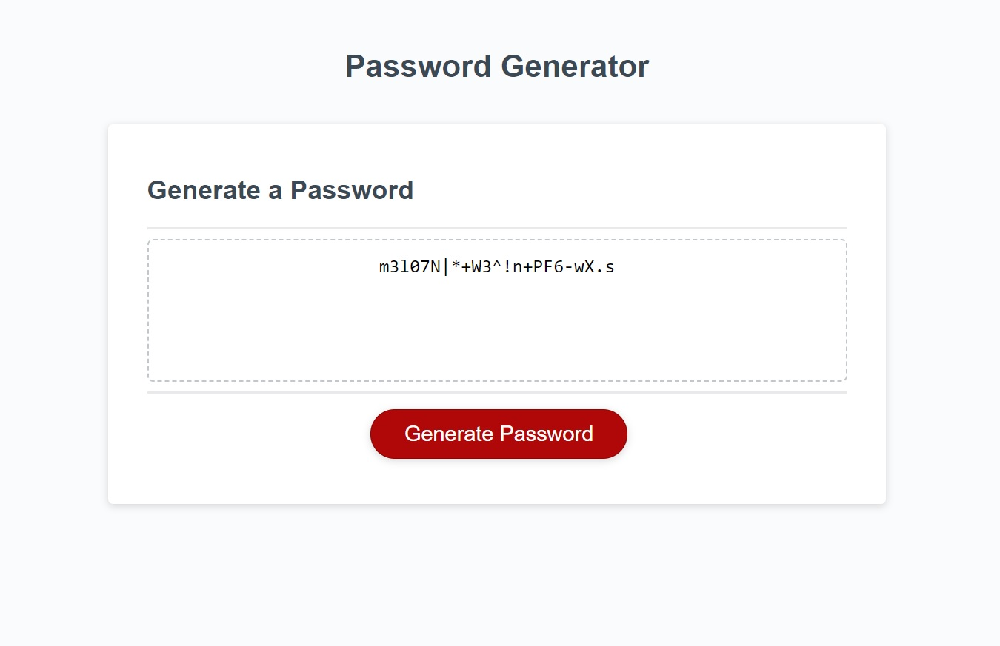

# Challenge-03-JavaScript-Password-Generator


```

Password generator website is an incredible tool to have at the tips of your fingers.
This simple page will provide you with a secure password by clicking few buttons.
Website is optimized to accessibility standards using semantic html elements.

```
The following image shows the web application's appearance and functionality:




[Password Generator Website](https://00rest.github.io/Challenge-03-JavaScript-Password-Generator/)


```
When you need a new, secure password.
You can click the button to generate a password.

You will be presented with a series of prompts for password criteria.

When prompted for password criteria,
You can select which criteria to include in the password.

When prompted for the length of the password,
You can choose a length of at least 8 characters and no more than 128 characters.

When asked for character types to include in the password,
You can confirm whether or not to include lowercase, uppercase, numeric, and/or special characters.

After you answer each prompt,
Your input will be validated and at least one character type will have be selected.

After all prompts are answered properly,
The password is generated that matches the selected criteria

When the password is generated
It it will displayed in the page designated box.

```
